<!-- hero: monochrome ASCII portrait (types in) beside the terminal info card
     (staggered rise/fade neofetch panel).
     widths (300 / 540) are chosen so both panels land at the exact same height (313px).
     portrait: python scripts/prep_photo.py <photo> && python scripts/make_ascii_svg.py
     info card: python scripts/make_info_card.py -->

<h3><code>Vishrut2105@github ~ $ whoami</code></h3>

<!-- animated contribution graph: real data, boxes reveal cell by cell
     (regenerated daily by .github/workflows/update-profile-art.yml) -->

<h3><code>Vishrut2105@github ~ $ ./contributions.sh</code></h3>

 
 

<table>
<tr>
<td valign="top"></td>
<td valign="top"></td>
</tr>
</table>

 

<h3><code>Vishrut2105@github ~ $ ./links.sh</code></h3>

<b>Student @ ADIT, Anand · Co-Founder @ UNITAPP Software Solutions</b>

 

